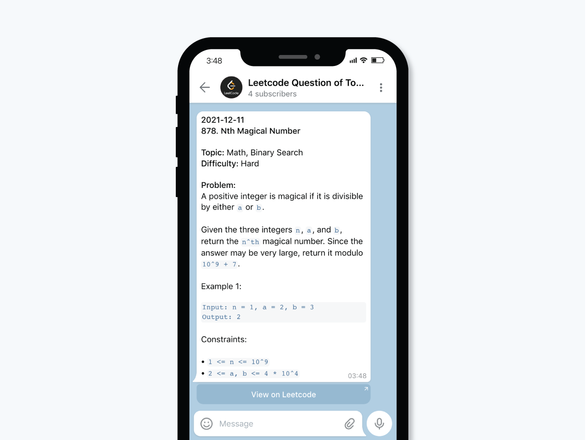

# Leetcode Daily Question Telegram Bot

Fetch question of today from Leetcode's GraphQL API and send it to Telegram channel.



## Development Notes

### Tech Stack
* Python 3
* [Serverless](https://www.npmjs.com/package/serverless)
* AWS Lambda
* AWS CloudFormation - Used by Serverless when doing deployment
* AWS CloudWatch - Automatically Setup by Serverless when doing deployment
* AWS S3 - Used by Serverless when doing deployment

> **Note:**  
> Both Lambda, CloudWatch, and CloudFormation has free tier provided. However for AWS S3, it has only has free tier for limited time.
> 
> To check the tier limit, head to [https://aws.amazon.com/free/](https://aws.amazon.com/free/). It is recommended to setup a billing alert by following the documentation on [https://docs.aws.amazon.com/awsaccountbilling/latest/aboutv2/tracking-free-tier-usage.html](https://docs.aws.amazon.com/awsaccountbilling/latest/aboutv2/tracking-free-tier-usage.html). 

### Development Setup

#### Prerequisites
* Node.js 14 installed
* Python 3 installed
* `virtualenv` installed

#### Prepare `serverless` environment

##### NPM

```bash
npm install serverless@2.63.0 --global
npm install
```

##### Yarn

```bash
yarn global add serverless@2.63.0
yarn
```

#### Setup Python Virtual Environments

```bash
# Create a new virtual environment
virtualenv venv --python=python3

# Activate virtual environment created
. venv/bin/activate

# Install dependencies listed in requirements.txt
pip install -r requirements.txt
```

#### Setup Bot to send message

Save a copy of `.env`  and name it as `.env.local`, place your Telegram bot token and Telegram Chat ID in the configuration file.

> **Note:**
> Environment variables are used instead of `ConfigParser` provided by Python since [by default AWS Lambda will encrypt environment variables using KMS](https://docs.aws.amazon.com/whitepapers/latest/kms-best-practices/encrypting-lambda-environment-variables.html), and we don't want to store tokens using plain text.

##### 1. How to get a Telegram bot token

1. In Telegram, search for the user `@BotFather`.
2. Use the command `\newbot` and choose a name and username for your bot.
3. `@BotFather` will return you the token of the bot created. Remember to keep it safe!

##### 2. How to get a Telegram chat ID

1. Send a `/start` command to the telegram bot created in the previous step
2. Visit `https://api.telegram.org/bot<BOT_TOKEN>/getUpdates`
3. Look at the API response, `result[0]['message']['chat']['id']` should contains ID of the chat. Remember to copy the `-` prefix if exists.

##### 3. Test if Bot token and Chat ID is correct or not

Open Terminal, run the following command. You will need to replace `<BOT_TOKEN>` and `<CHAT_ID>` with the one you get in previous steps.

```bash
curl -X POST "https://api.telegram.org/bot<BOT_TOKEN>/sendMessage" -d "chat_id=<CHAT_ID>&text=Hello World"
```

#### Deployment

##### Create named AWS profile (for first time deployment)

1. Create new user on AWS, with "Programmatic access"
2. Assign permission to user by "Attaching existing policies directly"
    * In the official Serverless blog, they have introduced [serverless-policy generator](https://github.com/dancrumb/generator-serverless-policy) to help you generate IAM policies.
3. Configure new AWS credientials to use newly created user
    ```bash
    aws configure --profile <PROFILE_NAME>
    ```

##### Deploy to Lambda

```bash
# Load environment variables
. load-environment-variables.sh

# Deploy to AWS Lambda using serverless cli
serverless deploy --aws-profile <PROFILE_NAME>
```

#### Settings

##### Add / Edit bot messages
All messages are stored in `app/messages.txt`, and will be randomly picked when handler is triggered. To update the message sets, simply edit and save the file. Re-deployment is needed for changes to take effect.

##### Add / Edit stickers
All sticker IDs are stored in `app/stickers.txt`, and will be randomly picked when handler is triggered. To update the sticker sets, you will need to get the sticker ID by sending stickers to the created bot. Visit `https://api.telegram.org/bot<BOT_TOKEN>/getUpdates`, stickers ID can be found in the API reponse node `result[n]['message']['sticker']['file_id']`. Re-deployment is needed for changes to take effect.

##### Edit bot schedule

Open `serverless.yml`, edit `functions['cron']['schedule']`. Syntax reference: [https://docs.aws.amazon.com/lambda/latest/dg/services-cloudwatchevents-expressions.html](https://docs.aws.amazon.com/lambda/latest/dg/services-cloudwatchevents-expressions.html)

#### Test

##### Testing the handler

Run the following command inside virtual environment:
```bash
# Load environment variables
. load-environment-variables.sh

# Execute handler
serverless invoke local -f cron
```

#### Others

##### Delete deployed Lambda function

```bash
serverless remove --aws-profile <PROFILE_NAME>
```
